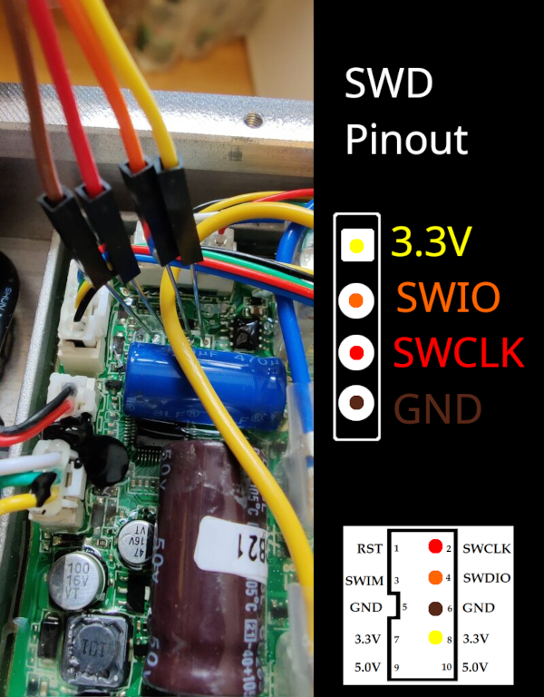

# ST-Link LKS32 / ES32
This repository provides instructions on how to dump and flash LKS32 / ES32 microcontroller units (MCUs) using a standard ST-Link probe, and how to modify certain parameters. Please check the [Disclaimer](#disclaimer) before proceeding.

## Installation
1. Install python
2. Install `pyocd` with pip: `pip install pyocd`
3. Download CMSIS Pack file
    1. LKS32: Download [Pack](Linko.LKS08x.1.1.4.pack) ([Source](https://www.lksmcu.com/static/upload/file/20230113/Linko.LKS08x_v1.14.zip))
    2. ES32: Download [Pack](Eastsoft.ES32_DFP.1.0.15.pack) ([Source](https://www.essemi.com/index/article/download?id=921))

Note: These examples use a LKS08x package. You can apply the procedure to a different MCU series using the appropriate Pack file.

## Basic procedure

### Hookup ST-Link

The image is showing Brightway "3 Lite" controller.

### Dump flash
Using `pyocd` and the Pack file downloaded before:

#### LKS32
`python -m pyocd cmd -c savemem 0 0x10000 mcu_fw.bin --pack Linko.LKS08x.1.1.4.pack --target lks32mc081c8t8`

#### ES32
`python -m pyocd cmd -c savemem 0x08000000 0x20000 mcu_fw.bin --pack Eastsoft.ES32_DFP.1.0.15.pack --target fs026r7l`

### Modify bin
Copy `mcu_fw.bin` to `mcu_fw_mod.bin` and make changes. See [Modifications](#modifications) for examples.

### Write bin back to flash
Using `pyocd` and the Pack file downloaded before:

#### LKS32
`python -m pyocd load mcu_fw_mod.bin --pack Linko.LKS08x.1.1.4.pack --target lks32mc081c8t8`

#### ES32
`python -m pyocd load mcu_fw_mod.bin --pack Eastsoft.ES32_DFP.1.0.15.pack --target fs026r7l`

#### Restore original binary
Simply run the above command with `mcu_fw.bin` instead of `mcu_fw_mod.bin`.

Advise: Keep the original binary in a safe place!

## Modifications
### Change SN of Brightway controller
1. Download the [SN script](bw_change_sn.py)
2. Using the script:

`python bw_change_sn.py mcu_fw_mod.bin <SN>`

For `<SN>` check the following table.

#### Serial Number Prefixes (Global)

| Model       | SN    |
|-------------|-------|
| 3 Lite      | 35793 |
| 4           | 46441 |
| 4 Lite      | 46415 |
| 4 Ultra     | 37829 |
| 4 Pro (2nd) | ????? |

## Disclaimer
The information provided on this page is intended for educational purposes only. The methods discussed are aimed at understanding the functionality and security aspects of microcontroller units (MCUs).

By accessing this information, you agree that the creators and publishers of this content are not responsible for any misuse of the knowledge shared here. You acknowledge that you are solely responsible for ensuring your activities comply with all applicable laws and regulations. The creators and publishers do not condone or encourage illegal activities in any form.

Always seek explicit permission from the relevant parties before attempting any form of modification or analysis of electronic systems. Use this information responsibly and ethically.
